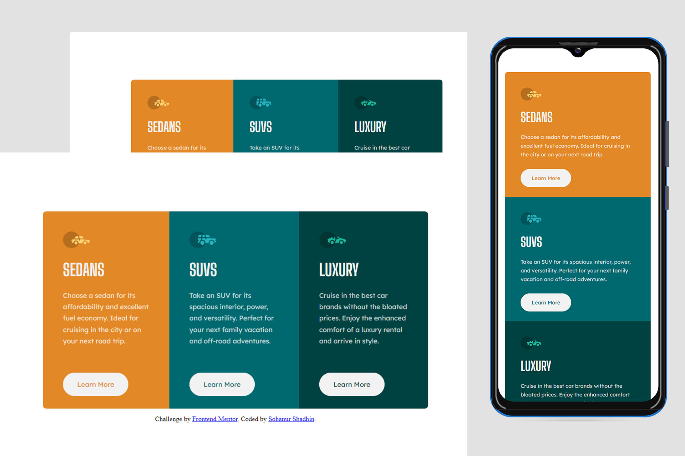

# Frontend Mentor - 3-column preview card component solution

This is a solution to the [3-column preview card component challenge on Frontend Mentor](https://www.frontendmentor.io/challenges/3column-preview-card-component-pH92eAR2-).

## Overview

### The challenge

Users should be able to:

- View the optimal layout depending on their device's screen size
- See hover states for interactive elements

### Screenshot

### Links

- Solution URL: [Three Column Preview](https://www.frontendmentor.io/solutions/3-column-preview-card-component-main-DJSH6AIF1L)
- Live Site URL: [Three Column Preview](https://fm-3-column-preview-cc.vercel.app/)

## My process

### Built with

- Semantic HTML5 markup
- CSS custom properties
- Flexbox
- Mobile-first workflow using media query
- Used local stored fonts

### What I learned

Perfect Centering:

I used css flexbox for perfect centering the desired div. The properties are justify content & align items is suitable for a div perfect centering in screen. To be sure to uses fixed width in parent div or it doesn't works.

```html
<div class="content-box-wrapper">
  <div class="container">
```
```css
.content-box-wrapper {
  width: 1280px;
  height: 800px;
  display: flex;
  justify-content: center;
  align-items: center;
}
.container {
  display: flex;
}
```

### Continued development

Must have to be in touched with Continues learning to gain a specefic concept clearly.

## Author

- Frontend Mentor - [@sohanurshadhin](https://www.frontendmentor.io/profile/sohanurshadhin)
- Instagram - [@SohanurShadhinn](https://www.instagram.com/sohanurshadhin/)
- LinkedIn - [@sohanurshadhin](https://www.linkedin.com/in/sohanurshadhin/)
- X - [@SohanurShadhinn](https://x.com/SohanurShadhinn)
